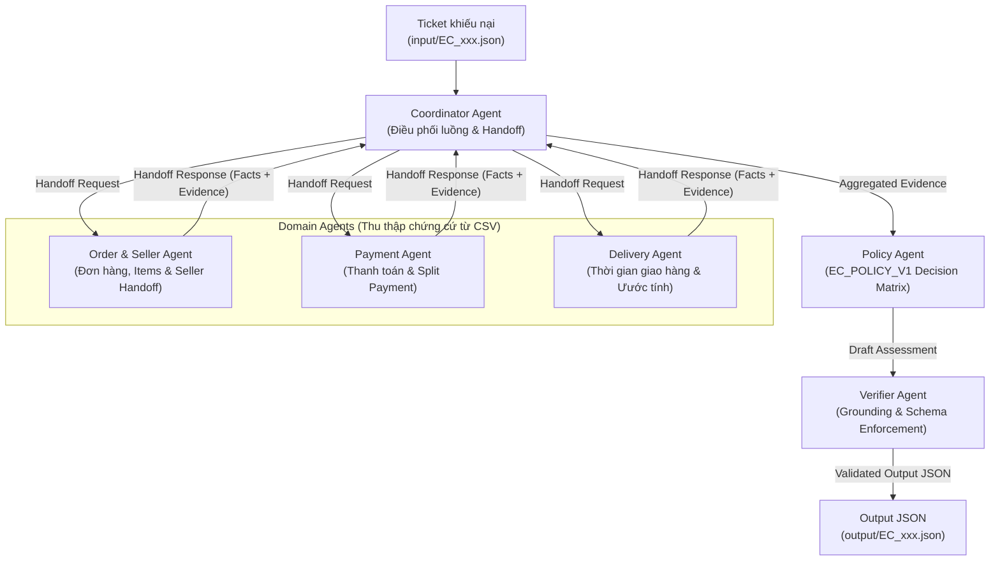

# KIẾN TRÚC MÔ HÌNH MULTI-AGENT — COHORT K3
## E-commerce Dispute Resolution System (`EC_POLICY_V1`)

---

## 1. Tổng quan Kiến trúc Hệ thống

Hệ thống xử lý khiếu nại thương mại điện tử Multi-Agent bao gồm 6 Agent chuyên trách phối hợp theo mô hình tập trung (Centralized Orchestration). **Coordinator Agent** đóng vai trò hạt nhân điều phối, nhận ticket khiếu nại khách hàng, phân chia nhiệm vụ cho các Domain Agent thu thập chứng cứ từ dữ liệu Olist, chuyển giao cho **Policy Agent** ra quyết định và cuối cùng qua **Verifier Agent** kiểm tra tính hợp lệ trước khi hoàn tất JSON output.



---

## 2. Vai trò & Quyền hạn truy cập dữ liệu của từng Agent

| Agent | Vai trò chính | Nguồn dữ liệu truy cập | Output bàn giao (Handoff) |
| :--- | :--- | :--- | :--- |
| **Coordinator Agent** | Nhận ticket, trích xuất `claimed_order_id`, khởi tạo handoff, điều phối luồng xử lý và tổng hợp output. | `input/EC_xxx.json` | Gói Handoff tổng hợp toàn bộ facts & evidence của case. |
| **Order & Seller Agent** | Kiểm tra trạng thái đơn hàng (`order_status`), danh sách item, thông tin seller và mốc bàn giao cho carrier. | `olist_orders_dataset.csv`<br>`olist_order_items_dataset.csv`<br>`olist_sellers_dataset.csv` | `order_status`, `seller_id`, `shipping_limit_date`, `order_delivered_carrier_date`, `item_ids`, `evidence_ids`. |
| **Payment Agent** | Kiểm tra các dòng thanh toán, tính tổng tiền, đối soát với tổng giá trị items + phí vận chuyển. | `olist_order_payments_dataset.csv` | `payment_rows`, `payment_total_brl`, `item_total_brl`, `freight_total_brl`, `payment_ids`, `evidence_ids`. |
| **Delivery Agent** | So sánh thời điểm giao hàng thực tế cho khách với hạn giao ước tính. | `olist_orders_dataset.csv` | `order_delivered_customer_date`, `order_estimated_delivery_date`, `is_late`, `evidence_ids`. |
| **Policy Agent** | Áp dụng chính sách `EC_POLICY_V1` để phân loại `primary_issue`, đề xuất refund và hành động xử lý. | Quy tắc nghiệp vụ `EC_POLICY_V1` | `primary_issue`, `case_status`, `root_cause_analysis`, `financial_resolution`, `resolution_actions`. |
| **Verifier Agent** | Đảm bảo tính grounding (mọi Evidence ID phải có trong CSV), đúng giới hạn mảng và đúng schema JSON. | Schema chuẩn K3 & Dữ liệu nguồn | File JSON hoàn chỉnh hợp lệ trong `output/`. |

---

## 3. Cấu trúc Giao thức Handoff (Handoff Protocol A2A)

Mọi giao tiếp giữa Coordinator và các Domain Agent tuân thủ chuẩn Handoff Packet sau:

```json
{
  "case_id": "EC_001",
  "claimed_order_id": "e481f51cbdc54678b7cc49136f2d6af7",
  "sender": "CoordinatorAgent",
  "receiver": "OrderSellerAgent",
  "intent": "INSPECT_ORDER_AND_SELLER_HANDOFF",
  "facts_found": {
    "order_status": "delivered",
    "order_delivered_carrier_date": "2017-10-04 19:55:00",
    "shipping_limit_date": "2017-10-06 11:07:15"
  },
  "evidence_ids": [
    "order:e481f51cbdc54678b7cc49136f2d6af7",
    "item:e481f51cbdc54678b7cc49136f2d6af7:1",
    "seller:3504c0cb714a208a5450fb910a026e42"
  ],
  "missing_facts": ["payment_reconciliation", "delivery_delay_days"],
  "next_recommendation": "ROUTE_TO_DELIVERY_AGENT"
}
```

---

## 4. Ma trận quyết định `EC_POLICY_V1` (Policy Engine)

Hệ thống đánh giá theo đúng 6 trường hợp của Cohort K3 theo thứ tự ưu tiên:

| Primary Issue | Trigger Condition | Responsible Party | Refund | Resolution Action | Root Cause Code |
| :--- | :--- | :--- | :---: | :--- | :--- |
| `canceled_order_paid` | `order_status = canceled` & Payment > 0 | `platform` (`OLIST_PLATFORM`) | Payment Total | `issue_full_refund` | `ORDER_CANCELED_AFTER_PAYMENT` |
| `unavailable_order_paid` | `order_status = unavailable` & Payment > 0 | `platform` (`OLIST_PLATFORM`) | Payment Total | `issue_full_refund` | `ORDER_UNAVAILABLE_AFTER_PAYMENT` |
| `late_delivery_seller` | Delivered > Estimated **AND** Carrier Received > Limit Date | `seller` (`<seller_id>`) | Freight Total | `refund_freight` | `SELLER_HANDOFF_AFTER_LIMIT` |
| `late_delivery_logistics` | Delivered > Estimated **AND** Carrier Received $\le$ Limit Date | `logistics_provider` (`LOGISTICS_PROVIDER`) | Freight Total | `refund_freight` | `CARRIER_DELIVERED_AFTER_ESTIMATE` |
| `valid_split_payment` | $\ge 2$ Payment rows & abs(Payment - Item - Freight) $\le 0.10$ | `none` | 0.0 | `explain_valid_split_payment` | `MULTIPLE_PAYMENTS_RECONCILED` |
| `unsupported_late_claim` | Delivered $\le$ Estimated & Payment Reconciled | `none` | 0.0 | `reject_late_refund` | `DELIVERY_WITHIN_ESTIMATE` |

---

## 5. Quy định Grounding & Verifier Enforcement

- **Format Evidence ID bắt buộc**:
  - `order:<order_id>`
  - `item:<order_id>:<order_item_id>`
  - `payment:<order_id>:<payment_sequential>`
  - `seller:<seller_id>`
  - `policy:<root_cause_code>`
- **Ràng buộc Schema Hard Gate**:
  - Entity IDs $\le 5$ items per set.
  - Evidence IDs $\le 10$ items.
  - Ranked Causes $\le 3$ items.
  - Responsible Parties $\le 3$ items.
  - Resolution Actions $\le 5$ items.
  - `confidence` $\in [0, 1]$.
